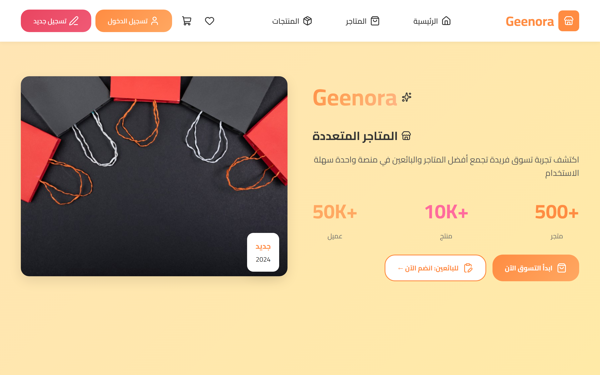

# Geenora Multi-Store Marketplace


## Visual Preview

<div align="center">
  
</div>


Geenora is a responsive Arabic Right-to-Left (RTL) multi-vendor e-commerce storefront. The interface is optimized for MENA regional commerce with native Cairo typography, CSS Grid and Flexbox layouts, and client-side cart interactions.

## Architecture and Core Features

- Native Right-to-Left Layout: Designed from the ground up for Arabic typography and right-to-left UI patterns.
- Responsive Viewport Scaling: Fluid layouts across desktop, tablet, and mobile devices using CSS Grid and CSS custom properties.
- Client Interaction Engine: Vanilla JavaScript DOM controller handling navigation state, category selection, and shopping cart persistence.
- Zero-Dependency Delivery: Pure HTML5, CSS3, and ES6 JavaScript with Lucide SVG iconography and Google Fonts Cairo.

## Project Structure

```
geenora-multistore-marketplace/
├── index.html      # Semantic HTML5 document structure
├── styles.css      # Design tokens, CSS custom properties, and responsive grid rules
├── script.js       # Navigation, category toggling, and client cart controller
└── README.md       # Architectural documentation
```

## Local Development

Preview the storefront locally using any static web server:

```bash
python -m http.server 8080
```

Open `http://localhost:8080` in your browser.
